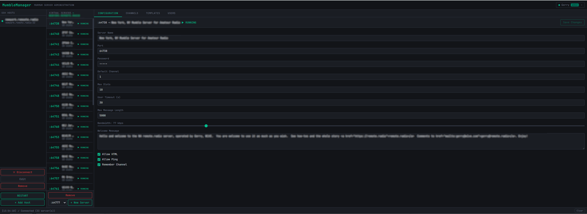
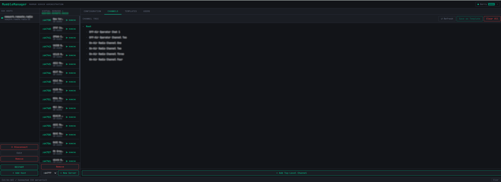
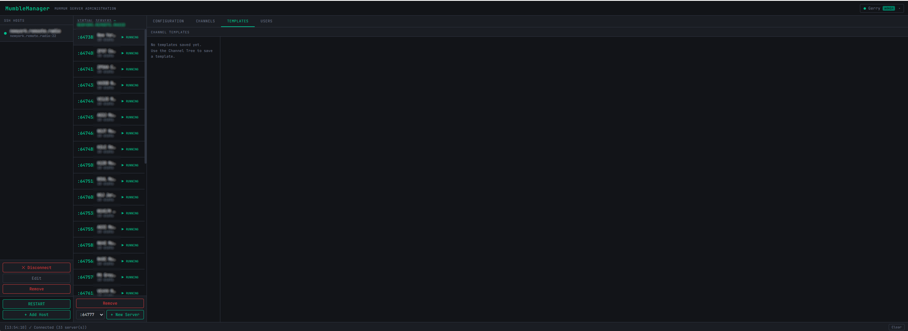

<div align="center">

# 🎙️ MumbleManager

**A modern web-based administration interface for [Mumble](https://www.mumble.info/) (Murmur) voice servers**

[](LICENSE)
[](https://dotnet.microsoft.com/)
[](https://react.dev/)
[](https://www.typescriptlang.org/)
[](https://www.docker.com/)
[](https://sqlite.org/)

*Manage your Mumble servers, channels, and users from any browser — no command-line access required.*

---

[Features](#-features) • [Tech Stack](#-tech-stack) • [Quick Start](#-quick-start) • [Configuration](#-configuration) • [Development](#-local-development) • [Security](#-security-notes) • [License](#-license)

</div>

---

## ✨ Features

| Feature | Description |
|---|---|
| 🖥️ **Virtual Server Admin** | View, start, stop, and configure Murmur virtual servers |
| 🌲 **Channel Tree Editor** | Browse, create, rename, move, and delete channels live |
| 📋 **Channel Templates** | Save channel layouts and apply them to any server in one click |
| 🔐 **SSH Host Management** | Reach remote Mumble servers safely through SSH tunnels |
| 👥 **User Management** | Create, promote, demote, reset passwords, and delete app accounts |
| 📡 **Real-Time Status** | SignalR-powered live connection state — no polling |
| 📧 **Email Notifications** | HTML email on account events and fatal errors (optional) |
| 🔑 **JWT Authentication** | Stateless token auth with 8-hour expiry and per-browser session isolation |
| 📖 **Swagger UI** | Full OpenAPI docs available in Development mode |

---

## 🏗️ Tech Stack

<table>
<tr>
<td valign="top" width="50%">

**Backend**
- ⚡ ASP.NET Core 9.0 — Minimal APIs
- 🗄️ SQLite + Entity Framework Core 9
- 🔐 JWT Bearer authentication
- 📡 ASP.NET Core SignalR
- 🧊 ZeroC ICE 3.7 (Murmur protocol)
- 🔒 SSH.NET (tunnel to remote servers)
- 📧 MailKit (SMTP / Gmail)

</td>
<td valign="top" width="50%">

**Frontend**
- ⚛️ React 18 + TypeScript
- ⚡ Vite 5
- 🐻 Zustand (state management)
- 📡 @microsoft/signalr
- 🎨 CSS Modules

**Infrastructure**
- 🐳 Docker (multi-stage build)
- 🌐 Nginx reverse proxy + TLS
- 📦 Docker Compose

</td>
</tr>
</table>

---

## 🏛️ Architecture

```
Browser  (HTTPS / WSS)
    │
    ▼
┌──────────────────────┐
│   Nginx  :443        │  ← TLS termination, HTTP→HTTPS redirect
└──────────┬───────────┘
           │ HTTP :5000
           ▼
┌──────────────────────────────────────────────────────┐
│  ASP.NET Core  —  MumbleManager.Api                  │
│                                                      │
│  REST endpoints  ──  JWT middleware                  │
│  SignalR hub  (/hubs/status)                         │
│  Static files  (compiled React SPA)                  │
│                                                      │
│  ┌─────────────┐    ┌──────────────────────────────┐ │
│  │  SQLite DB  │    │  SSH Tunnel → Murmur ICE     │ │
│  │  (EF Core)  │    │  (ZeroC ICE 3.7, port 6502)  │ │
│  └─────────────┘    └──────────────────────────────┘ │
└──────────────────────────────────────────────────────┘
```

> The React SPA is compiled at Docker build time and served as static files by the .NET process — there is no separate Node server in production.

---

## 🚀 Quick Start

### Prerequisites

- Linux VPS running **Ubuntu 22.04+**
- A **domain name** pointed at your server's IP
- Ports **80** and **443** open in your firewall
- A running **Murmur** server with ZeroC ICE enabled (see [Enabling ICE](#enabling-ice-on-murmur))

---

### 1 — Clone the repository

```bash
git clone https://github.com/YOUR_USERNAME/mumblemanager.git
cd mumblemanager
```

### 2 — Obtain TLS certificates

```bash
sudo apt install certbot

# Stop anything on port 80 first, then:
sudo certbot certonly --standalone -d your.domain.com

# Place certificates where Nginx expects them:
cp /etc/letsencrypt/live/your.domain.com/fullchain.pem nginx/certs/fullchain.pem
cp /etc/letsencrypt/live/your.domain.com/privkey.pem   nginx/certs/privkey.pem
chmod 600 nginx/certs/privkey.pem
```

### 3 — Configure your environment

```bash
cp .env.example .env
nano .env      # Fill in your domain, JWT secret, and email settings
```

### 4 — Set your domain in Nginx

Edit `nginx/nginx.conf` — replace **both** occurrences of `YOUR_DOMAIN.com` with your actual domain.

### 5 — Set your domain & secrets in docker-compose.yml

Edit `docker-compose.yml` and replace all `YOUR_*` placeholders.

### 6 — Deploy

```bash
chmod +x deploy.sh
sudo ./deploy.sh
```

`deploy.sh` will install Docker (if needed), build the image, start the stack, and confirm a healthy start. Your app will be live at `https://your.domain.com`. 🎉

---

### Manual Docker Compose

```bash
docker compose build
docker compose up -d
docker compose logs -f
```

---

## ⚙️ Configuration

All configuration is passed as **environment variables** to the `app` container.

| Variable | Required | Description |
|---|---|---|
| `Jwt__Secret` | ✅ | JWT signing key — minimum 32 random characters.<br>Generate: `openssl rand -base64 48` |
| `AllowedOrigins` | ✅ | Comma-separated CORS origins, e.g. `https://your.domain.com` |
| `ConnectionStrings__Default` | ✅ | SQLite path. Default: `Data Source=/data/mumblemanager.db` |
| `Email__SmtpHost` | ➖ | SMTP server. Default: `smtp.gmail.com` |
| `Email__SmtpPort` | ➖ | SMTP port (STARTTLS). Default: `587` |
| `Email__From` | ➖ | Sender email address |
| `Email__FromName` | ➖ | Sender display name. Default: `MumbleManager` |
| `Email__AppPassword` | ➖ | Gmail App Password. **Email is silently disabled when empty.** |
| `Email__AdminAddress` | ➖ | Address for admin notifications |
| `ASPNETCORE_ENVIRONMENT` | ➖ | Set to `Development` to enable Swagger at `/swagger` |

> 💡 **Gmail App Password:** Enable 2-Factor Authentication on your Google account, then generate an App Password at [myaccount.google.com/apppasswords](https://myaccount.google.com/apppasswords).

---

## 🔑 First Login & Initial Setup

On first start, MumbleManager seeds an admin account automatically.

> **Default credentials — change these immediately:**
> | Field | Value |
> |---|---|
> | Username | `admin` |
> | Password | *(value set in `DbSeeder.cs` before building)* |

After logging in, use **User Management** to create additional users and change the admin password via **Change Password**.

### Adding a Mumble Server

1. Click **Add Host** in the Hosts panel
2. Enter your SSH host details and the **ICE Secret** from your `murmur.ini`
3. Click **Connect** — MumbleManager opens an SSH tunnel and connects via ICE

### Enabling ICE on Murmur

In `murmur.ini` (or `mumble-server.ini`):

```ini
ice=tcp -h 127.0.0.1 -p 6502
icesecretread=YOUR_ICE_SECRET
icesecretwrite=YOUR_ICE_SECRET
```

Restart Murmur after saving. MumbleManager connects through the SSH tunnel, so Murmur's ICE port never needs to be exposed publicly.

---

## 💻 Local Development

### Backend

```bash
cd backend
dotnet restore

ASPNETCORE_ENVIRONMENT=Development \
  Jwt__Secret="dev-secret-key-at-least-32-characters!!" \
  dotnet run
# API + Swagger at http://localhost:5000
```

### Frontend

```bash
cd frontend
npm install
npm run dev
# Vite dev server at http://localhost:5173
# Proxies /api and /hubs → http://localhost:5000 automatically
```

### Database Migrations

```bash
cd backend
dotnet tool install --global dotnet-ef   # first time only
dotnet ef migrations add YourMigrationName
```

Schema is applied automatically on startup via `DbSeeder.SeedAsync()`.

---

## 📁 Project Structure

```
mumblemanager/
├── backend/
│   ├── Data/                    # EF Core DbContext + migrations
│   ├── Endpoints/               # Minimal API route handlers
│   │   ├── AuthEndpoints.cs
│   │   ├── ChannelEndpoints.cs
│   │   ├── ConnectionEndpoints.cs
│   │   ├── HostEndpoints.cs
│   │   ├── ServerEndpoints.cs
│   │   ├── TemplateEndpoints.cs
│   │   └── UserEndpoints.cs
│   ├── Generated/               # Auto-generated ZeroC ICE bindings
│   ├── Hubs/StatusHub.cs        # SignalR real-time hub
│   ├── Models/                  # EF entities + DTOs
│   ├── Services/
│   │   ├── AuthService.cs       # PBKDF2 hashing + JWT generation
│   │   ├── DbSeeder.cs          # Seeds initial admin account
│   │   ├── EmailService.cs      # SMTP via MailKit
│   │   ├── HostSession.cs       # Per-user ICE session registry
│   │   ├── MumbleServerIceService.cs
│   │   ├── MurmurLegacyIceService.cs
│   │   ├── SshTunnelService.cs  # SSH port forwarding
│   │   └── MurmurVersion.cs     # Auto version detection
│   ├── appsettings.json
│   └── Program.cs
│
├── frontend/src/
│   ├── api/index.ts             # Typed API client
│   ├── components/              # React UI components
│   ├── hooks/useSignalR.ts      # SignalR connection hook
│   ├── store/                   # Zustand global state
│   └── types/index.ts           # Shared TypeScript types
│
├── nginx/
│   ├── nginx.conf               # Reverse proxy + TLS config
│   └── certs/                   # TLS certificates (gitignored)
│
├── .env.example                 # Environment variable template
├── Dockerfile                   # Multi-stage build
├── docker-compose.yml
├── deploy.sh                    # One-shot Ubuntu deployment
└── README.md
```

---

## 🔒 Security Notes

> ⚠️ Please read before deploying to production.

- **Change the default admin password** immediately after first login
- **Generate a strong JWT secret** — at minimum 48 random bytes: `openssl rand -base64 48`
- **Never commit** `nginx/certs/` or your `.env` file — both are gitignored
- **SSH credentials** are stored in the SQLite database; protect `/data/mumblemanager.db` with appropriate filesystem permissions
- Passwords are hashed with **PBKDF2 / SHA-256**, 100,000 iterations, random 16-byte salt
- The .NET container is **not exposed directly** to the internet — all traffic passes through Nginx

---

## 🤝 Contributing

Pull requests are welcome! For major changes, please open an issue first to discuss what you'd like to change.

1. Fork the repository
2. Create a feature branch: `git checkout -b feature/your-feature`
3. Commit your changes: `git commit -m 'Add some feature'`
4. Push to the branch: `git push origin feature/your-feature`
5. Open a Pull Request

---
## 📸 Screenshots

<p align="center">
  
</p>

<p align="center">
  
</p>

<p align="center">
  
</p>

## 📄 License

Copyright © 2026 **Gerald Hull, W1VE**

Released under the [MIT License](LICENSE) — see the `LICENSE` file for details.

---

<div align="center">
<sub>Built with ❤️ for the amateur radio and open-source communities.</sub>
</div>
